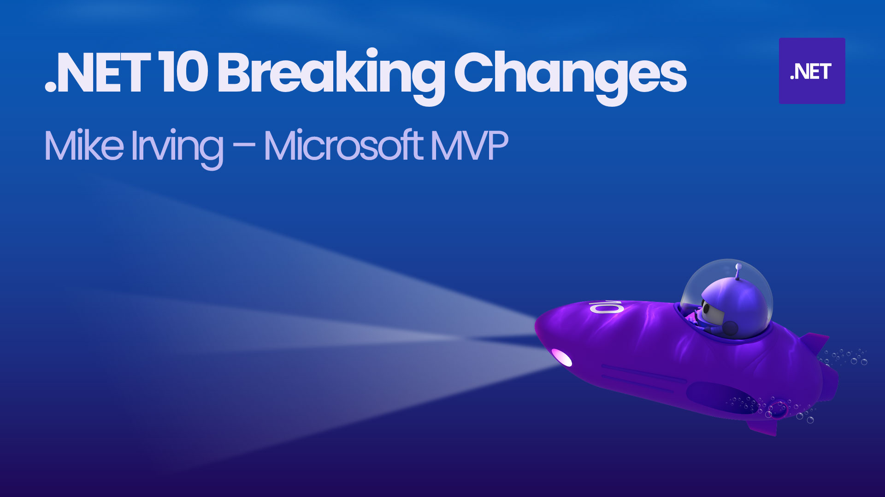

# .NET Conf Local - .NET 10 Breaking Changes  
Presentation for the [Dot Net North](https://www.meetup.com/DotNetNorth) '.NET Conf Local' event in January 2026. An overview of .NET 10 Breaking Changes.  

[Event Meetup Listing](https://www.meetup.com/dotnetnorth/events/311234537/) • [Presentation Link](https://mikeirvingweb.s3.eu-west-2.amazonaws.com/dotnet-conf-local-jan-2026-net10-breaking-changes/2026-01-13-Mike-Irving-.NET-10-Breaking-Changes.pptx)  

**Links from presentation**

🎓 [Breaking changes in .NET 10 - Microsoft Learn](https://learn.microsoft.com/en-us/dotnet/core/compatibility/10?WT.mc_id=MVP_307078)  

**ASP.NET Core**  
- [Cookie login redirects are disabled for known API endpoints](https://learn.microsoft.com/en-us/dotnet/core/compatibility/aspnet-core/10/cookie-authentication-api-endpoints?WT.mc_id=MVP_307078)  
- [Deprecation of WithOpenApi extension method](https://learn.microsoft.com/en-us/dotnet/core/compatibility/aspnet-core/10/withopenapi-deprecated?WT.mc_id=MVP_307078)  
- [Razor runtime compilation is obsolete](https://learn.microsoft.com/en-us/dotnet/core/compatibility/aspnet-core/10/razor-runtime-compilation-obsolete?WT.mc_id=MVP_307078)  

**Containers**  
- [Default .NET images use Ubuntu](https://learn.microsoft.com/en-us/dotnet/core/compatibility/containers/10.0/default-images-use-ubuntu?WT.mc_id=MVP_307078)  

**Core .NET Libraries**  
- [Consistent shift behavior in generic math](https://learn.microsoft.com/en-us/dotnet/core/compatibility/core-libraries/10.0/generic-math?WT.mc_id=MVP_307078)
- [Specifying explicit struct Size disallowed with InlineArray](https://learn.microsoft.com/en-us/dotnet/core/compatibility/core-libraries/10.0/inlinearray-explicit-size-disallowed?WT.mc_id=MVP_307078)  
- [System.Linq.AsyncEnumerable in .NET 10](https://learn.microsoft.com/en-us/dotnet/core/compatibility/core-libraries/10.0/asyncenumerable?WT.mc_id=MVP_307078)  

**Cryptography**  
- [Environment variable renamed to DOTNET_OPENSSL_VERSION_OVERRIDE](https://learn.microsoft.com/en-us/dotnet/core/compatibility/cryptography/10.0/version-override?WT.mc_id=MVP_307078)
- [.NET 10 requires OpenSSL 1.1.1 or later on Unix](https://learn.microsoft.com/en-us/dotnet/core/compatibility/cryptography/10.0/openssl-version-requirement?WT.mc_id=MVP_307078)  

**Extensions**  
- [Message no longer duplicated in Console log output](https://learn.microsoft.com/en-us/dotnet/core/compatibility/extensions/10.0/console-json-logging-duplicate-messages?WT.mc_id=MVP_307078)  

**Globalization**  
- [Environment variable renamed to DOTNET_ICU_VERSION_OVERRIDE](https://learn.microsoft.com/en-us/dotnet/core/compatibility/globalization/10.0/version-override?WT.mc_id=MVP_307078)  

**Networking**  
- [Uri length limits removed](https://learn.microsoft.com/en-us/dotnet/core/compatibility/networking/10.0/uri-length-limits-removed?WT.mc_id=MVP_307078)  

**SDK and MSBuild**  
- [dotnet new sln defaults to SLNX file format](https://learn.microsoft.com/en-us/dotnet/core/compatibility/sdk/10.0/dotnet-new-sln-slnx-default?WT.mc_id=MVP_307078)
- [project.json no longer supported in dotnet restore](https://learn.microsoft.com/en-us/dotnet/core/compatibility/sdk/10.0/dotnet-restore-project-json-unsupported?WT.mc_id=MVP_307078)  
- [PackageReference without a version will raise an error](https://learn.microsoft.com/en-us/dotnet/core/compatibility/sdk/10.0/nu1015-packagereference-version?WT.mc_id=MVP_307078)  

**Serialization**  
- [XmlSerializer no longer ignores properties marked with ObsoleteAttribute](https://learn.microsoft.com/en-us/dotnet/core/compatibility/serialization/10/xmlserializer-obsolete-properties?WT.mc_id=MVP_307078)  

**WPF**  
- [Empty ColumnDefinitions and RowDefinitions are disallowed](https://learn.microsoft.com/en-us/dotnet/core/compatibility/wpf/10.0/empty-grid-definitions?WT.mc_id=MVP_307078)  

   

🚀 [Get .NET 10](https://dotnet.microsoft.com/en-us/download/dotnet/10.0?WT.mc_id=MVP_307078)  

---
For more info, find / contact me at:  
[Bluesky](https://bsky.app/profile/mikeirvingweb.bsky.social) • [X / Twitter](https://twitter.com/mikeirvingweb) • [LinkedIn](https://www.linkedin.com/in/mikeirving) • [GitHub](https://github.com/mikeirvingweb) • [Sessionize](https://sessionize.com/mikeirving/) • [Website & Blog](https://www.mike-irving.co.uk/) 
